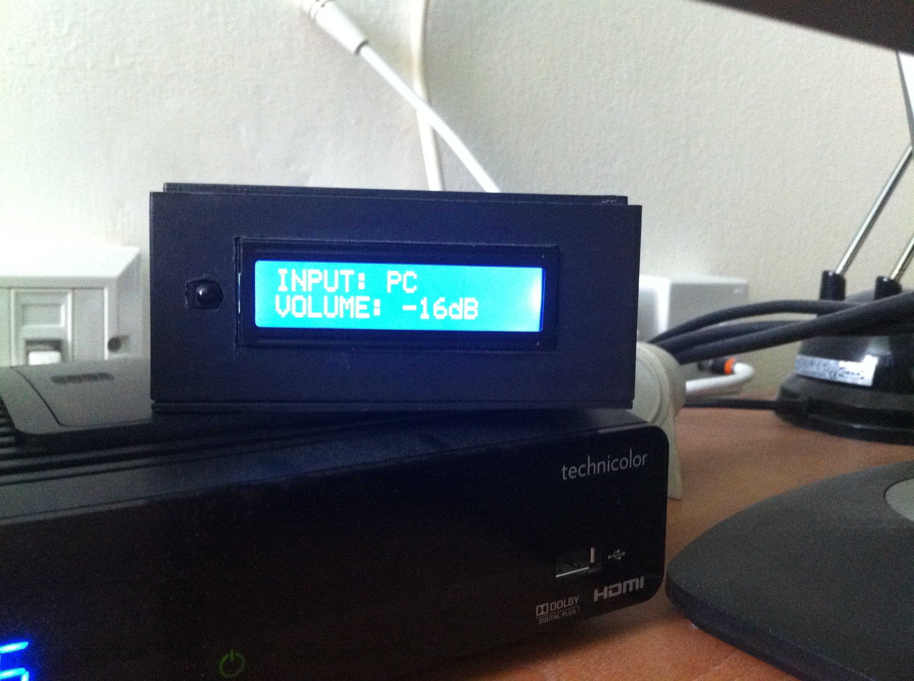
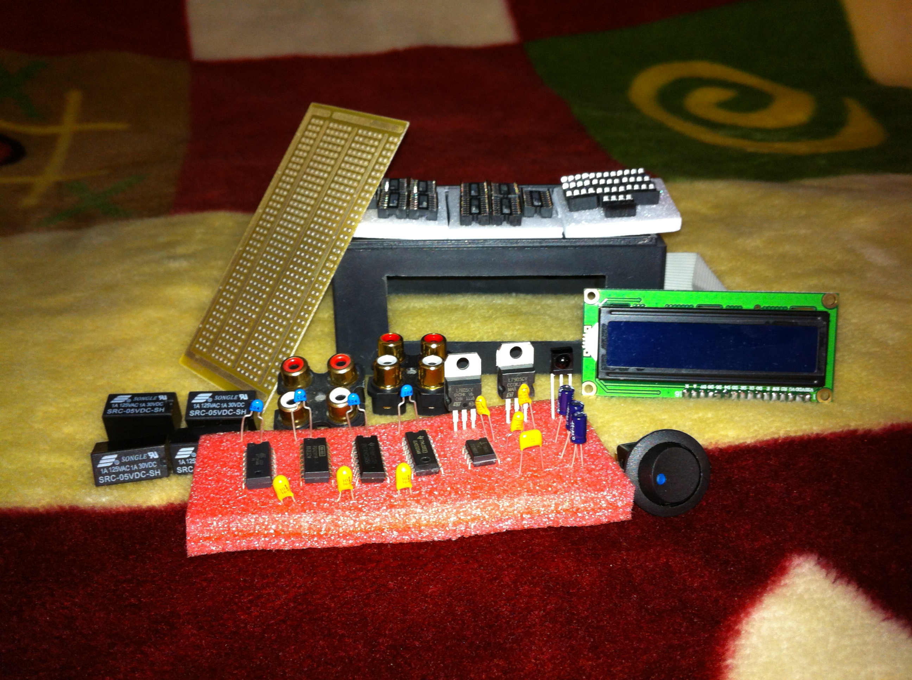

My Pre-Amp 2013
=========================

About this project
==================
In this project I created my own pre-amp with 4 stereo input.
Attiny44 using to control the board logic and the IR receiver.

Parts
=====

